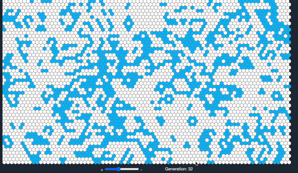

# HexGrid Automata

**Demo**:
https://zzhengzhu.github.io/hexgrid-automata/

Reference and acknowledgement:

https://github.com/PabloRegen/game-of-life

https://www.wikiwand.com/en/Conway%27s_Game_of_Life

Some codes and documentations are generated by ChatGPT

## Introduction to Hexagonal Grid Automata

In the realm of computational simulations and cellular automata, the hexagonal grid emerges as a captivating canvas where complexity unfolds through simple rules. This intriguing space of interlocking hexagons provides the backdrop for our exploration into the dynamics of life and death, governed by rules that breathe life into a mesmerizing dance of patterns.

The Hexagonal Grid Automata is a fascinating simulation that draws inspiration from the natural world and the principles of emergent behavior. In this digital domain, each hexagonal cell mirrors a lifeform, oscillating between existence and oblivion based on a set of elegantly crafted rules.

At the heart of this simulation lies the concept of neighbors - a cell's immediate companions. Through their interactions, they wield the power to determine the fate of a cell. As cycles progress, some cells fade into darkness, while others ignite with vitality, echoing the ebb and flow of existence itself.

Our automata's rulebook is ingeniously devised to mimic the essence of life's emergence. Cells are born anew when surrounded by a specific number of neighbors, a testament to the delicate balance required for creation. Conversely, overpopulation or solitude leads to a cell's demise, underscoring the profound interdependence that governs life's harmony.

However, the true marvel lies in the enigmatic four-count rule, where a cell's destiny hinges on the parity of its neighbors. It's a rule that imparts a touch of unpredictability, a hint of chaos, and a dash of rebellion against the expected. Cells toggle between states, creating a mesmerizing symphony of transformation that defies convention.

Join us in this captivating journey as we delve into the Hexagonal Grid Automata. Witness the emergence of intricate patterns, the rise and fall of civilizations, and the delicate balance between order and randomness. Through the lens of hexagonal cells, we gain a deeper appreciation for the delicate interplay that shapes the tapestry of life itself.

Step into a world where simplicity begets complexity, where hexagons dance to the rhythm of rules, and where emergent beauty resides in the hearts of automata.
